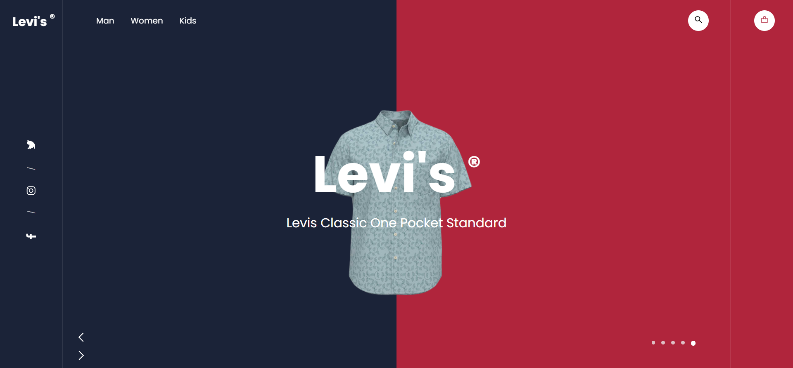
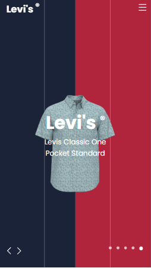

<p align="center">
  
</p>

## Desktop
<h1 align="center">
    
</h1>

<br>

## Mobile
<h1 align="center">
    
</h1>

## ⚙️ Tecnologias
Este projeto foi desenvolvido utilizando:

- [ReactJS](https://reactjs.org/)
- [React Icons](https://react-icons.github.io/react-icons/)
- [GSAP](https://greensock.com/react/)
- [Vite](https://vitejs.dev/)

## 📌 Começando

Clone o projeto:

```bash
git clone https://github.com/gabrielcoutinh0/Levis-landing-page.git
cd Levis-landing-page
```

Instale as dependências :

```bash
yarn
yarn run dev
```

## 🖼️ Inspiração
- [ananikets18](https://github.com/ananikets18/responsive-landing-page-using-html-css-js)